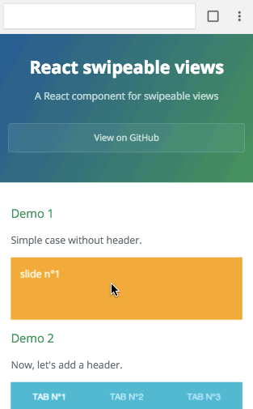
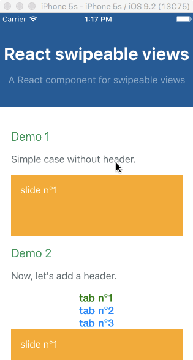
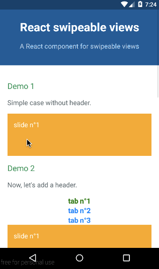

# react-swipeable-views

> A React component for swipeable views.

[](https://www.npmjs.com/package/react-swipeable-views)
[](https://www.npmjs.com/package/react-swipeable-views)
[](https://travis-ci.org/oliviertassinari/react-swipeable-views)

[](https://david-dm.org/oliviertassinari/react-swipeable-views)
[](https://david-dm.org/oliviertassinari/react-swipeable-views#info=devDependencies&view=list)

[](http://definitelytyped.org)

## Installation

### Browser

```sh
npm install --save react-swipeable-views
```

### Native

```sh
npm install --save react-swipeable-views-native
```

## The problem solved

Check out the [demos](http://oliviertassinari.github.io/react-swipeable-views/) from a mobile device (real or emulated).
It's tiny (<4kB), it quickly renders the first slide, then lazy-loads the others.

## Simple example


### Browser

```jsx
import React from 'react';
import SwipeableViews from 'react-swipeable-views';

const styles = {
  slide: {
    padding: 15,
    minHeight: 100,
    color: '#fff',
  },
  slide1: {
    background: '#FEA900',
  },
  slide2: {
    background: '#B3DC4A',
  },
  slide3: {
    background: '#6AC0FF',
  },
};

const MyComponent = () => (
  <SwipeableViews>
    <div style={Object.assign({}, styles.slide, styles.slide1)}>
      slide n°1
    </div>
    <div style={Object.assign({}, styles.slide, styles.slide2)}>
      slide n°2
    </div>
    <div style={Object.assign({}, styles.slide, styles.slide3)}>
      slide n°3
    </div>
  </SwipeableViews>
);

export default MyComponent;
```

### Native

```jsx
import React from 'react';
import {
  StyleSheet,
  Text,
  View,
} from 'react-native';

import SwipeableViews from 'react-swipeable-views-native';
// There is another version using the scroll component instead of animated.
// I'm unsure which one give the best UX. Please give us some feedback.
// import SwipeableViews from 'react-swipeable-views-native/lib/SwipeableViews.scroll';

const styles = StyleSheet.create({
  slideContainer: {
    height: 100,
  },
  slide: {
    padding: 15,
    height: 100,
  },
  slide1: {
    backgroundColor: '#FEA900',
  },
  slide2: {
    backgroundColor: '#B3DC4A',
  },
  slide3: {
    backgroundColor: '#6AC0FF',
  },
  text: {
    color: '#fff',
    fontSize: 16,
  },
});

const MyComponent = () => (
  <SwipeableViews style={styles.slideContainer}>
    <View style={[styles.slide, styles.slide1]}>
      <Text style={styles.text}>
        slide n°1
      </Text>
    </View>
    <View style={[styles.slide, styles.slide2]}>
      <Text style={styles.text}>
        slide n°2
      </Text>
    </View>
    <View style={[styles.slide, styles.slide3]}>
      <Text style={styles.text}>
        slide n°3
      </Text>
    </View>
  </SwipeableViews>
);

export default MyComponent;
```

## Supported platforms

The API is as consistent as possible between the three platforms so
the same component can be used independently on where it's running.

### Browser


| IE    | Edge | Windows Phone | Firefox | Chrome | Safari |
|:------|:-----|:--------------|:--------|:-------|:-------|
| >= 10 | ✓    | x             | >= 28   | >= 29  | >= 8   |

### iOS


### Android


## Example with `virtualize`

The infinite feature is provided thanks to a *higher order component*.
It's working independently of the targeted platform.
You can have a look at *Demo 8* to see it in action.
It's highly inspired by [react-virtualized](https://github.com/bvaughn/react-virtualized).
Let's see an example with the browser:

```jsx
import React from 'react';
import SwipeableViews from 'react-swipeable-views';
import { virtualize } from 'react-swipeable-views-utils';

const VirtualizeSwipeableViews = virtualize(SwipeableViews);

const slideRenderer = ({key, index}) => (
  <div key={key}>
    {`slide n°${index + 1}`}
  </div>
);

const MyComponent = () => (
  <VirtualizeSwipeableViews slideRenderer={slideRenderer} />
);

export default MyComponent;
```

## Example with `autoPlay`

The auto play feature is provided thanks to a *higher order component*.
It's working independently of the targeted platform.
You can have a look at *Demo 7* to see it in action.
Let's see an example with the browser:

```jsx
import React from 'react';
import SwipeableViews from 'react-swipeable-views';
import { autoPlay } from 'react-swipeable-views-utils';

const AutoPlaySwipeableViews = autoPlay(SwipeableViews);

const MyComponent = () => (
  <AutoPlaySwipeableViews>
    <div>slide n°1</div>
    <div>slide n°2</div>
    <div>slide n°3</div>
  </AutoPlaySwipeableViews>
);

export default MyComponent;
```

## Example with `bindKeyboard`

The keyboard navigation feature is provided thanks to a *higher order component*.
You can have a look at *Demo 9* to see it in action.
Let's see an example with the browser:

```jsx
import React from 'react';
import SwipeableViews from 'react-swipeable-views';
import { bindKeyboard } from 'react-swipeable-views-utils';

const BindKeyboardSwipeableViews = bindKeyboard(SwipeableViews);

const MyComponent = () => (
  <BindKeyboardSwipeableViews>
    <div>slide n°1</div>
    <div>slide n°2</div>
    <div>slide n°3</div>
  </BindKeyboardSwipeableViews>
);

export default MyComponent;
```

## API

### `<SwipeableViews />`

| Name | Type | Default | Platform | Description |
|:-----|:-----|:--------|:---------|:------------|
| animateHeight | bool | `false` | browser | If `true`, the height of the container will be animated to match the current slide height. Animating another style property has a negative impact regarding performance. |
| animateTransitions | bool | `true` | all | If `false`, changes to the index prop will not cause an animated transition. |
| axis | enum [`'x'`, `'x-reverse'`, `'y'`, `'y-reverse'`] | `'x'` | browser | The axis on which the slides will slide. |
| children | node | | all | Use this property to provide your slides. |
| containerStyle | object | `{}` | all | Whether or not the auto complete is animated as it is toggled. |
| disabled | bool | `false` | all | If `true`, it will disable touch events. This is useful when you want to prohibit the user from changing slides. |
| disableLazyLoading | bool | false | browser | This is the config used to disable lazy loading, if `true` it will render all the views in first rendering. |
| enableMouseEvents | bool | `false` | browser | If `true`, it will enable mouse events. This will allow the user to perform the relevant swipe actions with a mouse. |
| hysteresis | float | `0.6` | all | Configure hysteresis between slides. This value determines how far should user swipe to switch slide. |
| ignoreNativeScroll | bool | false | browser | If `true`, it will ignore native scroll container. It can be used to filter out false positive that blocks the swipe. |
| index | integer | `0` | all | This is the index of the slide to show. This is useful when you want to change the default slide shown. Or when you have tabs linked to each slide. |
| onChangeIndex | function(index, indexLatest) | | all | This is callback prop. It's call by the component when the shown slide change after a swipe made by the user. This is useful when you have tabs linked to each slide. |
| onSwitching | function(index, type) | | all | This is callback prop. It's called by the component when the slide switching. This is useful when you want to implement something corresponding to the current slide position. |
| onTransitionEnd | function | | all | The callback that fires when the animation comes to a rest. This is useful to defer CPU intensive task. |
| resistance | bool | `false` | all | If true, it will add bounds effect on the edges. |
| style | object | `{}` | all | This is the inlined style that will be applied on the root component. |
| slideStyle | object | `{}` | all | This is the inlined style that will be applied on the slide component. |
| springConfig | object | `{duration: '0.3s', easeFunction: '...', delay: '0s'}` | browser | This is the config used to create CSS transitions. This is useful to change the dynamic of the transition. |
| springConfig | object | `{tension: 300, friction: 30}` | native.animated | This is the config given to Animated for the `spring`. This is useful to change the dynamic of the transition. |
| threshold | integer | `5` | all | This is the threshold used for detecting a quick swipe. If the computed speed is above this value, the index change. |

Any other properties like `className` will be applied to the root component.

### `virtualize`

This HOC extends the properties of `<SwipeableViews />` and adds the following ones:

| Name | Type | Default | Platform | Description |
|:-----|:-----|:--------|:---------|:------------|
| overscanSlideAfter | integer | `2` | all | Number of slide to render after the visible slide. |
| overscanSlideBefore | integer | `3` | all | Number of slide to render before the visible slide. Separate from `overscanSlideAfter` as it's more difficult to keep the window up to date.|
| slideCount | integer | | all | When set, it's adding a limit to the number of slide: [0, slideCount]. |
| slideRenderer | func | | all | Responsible for rendering a slide given an index. ({ index: integer }): node |

### `autoPlay`

This HOC extends the properties of `<SwipeableViews />` and adds the following ones:

| Name | Type | Default | Platform | Description |
|:-----|:-----|:--------|:---------|:------------|
| autoplay | bool | `true` | all | If `false`, the auto play behavior is disabled. |
| direction | enum:<br>&nbsp;'incremental'<br>&nbsp;'decremental' | `'incremental'` | all | This is the auto play direction. |
| interval | integer | `3000` | all | Delay between auto play transitions (in ms). |

### `bindKeyboard`

This HOC exposes the same properties as `<SwipeableViews />`.

## Composition of HOCs

The composition order of the HOCs matters.
The `virtualize` HOC needs to be the first one called.
For instance:
```js
// creates a function that invokes the given functions from right to left.
import flowRight from 'lodash/flowRight';

const EnhancedSwipeableViews = flowRight(
  bindKeyboard,
  autoPlay,
  virtualized,
)(SwipeableViews);
```

## Performance on browser

Having 60 FPS is critical for this type of component.
We are rendering the slides at each request animation frame.
That has one specific implication for package users.
You need to add a **pure logic** in the *slides* components if your render method is expensive.

The performance is not as good as they could be if we were using a data binding to update the styles.
However, the implementation is simpler.

## Packages stucture

The project is split into multiple packages.
This is really useful for code sharing and isolation.
We are using [Lerna](https://github.com/lerna/lerna) to do so.
The project has the following packages:
- `react-swipeable-views-core`: core modules shared between the different packages.
- [react-swipeable-views](https://www.npmjs.com/package/react-swipeable-views): browser implementation of the `<SwipeableViews />` component.
- [react-swipeable-views-native](https://www.npmjs.com/package/react-swipeable-views-native): native implementation**s** of the `<SwipeableViews />` component.
- [react-swipeable-views-utils](https://www.npmjs.com/package/react-swipeable-views-utils): Higher order Components providing additional functionalities like `virtualize()`.

## License

MIT

<a target='_blank' rel='nofollow' href='https://app.codesponsor.io/link/exeebWrRmXisY5kkhcJd58AS/oliviertassinari/react-swipeable-views'></a>
